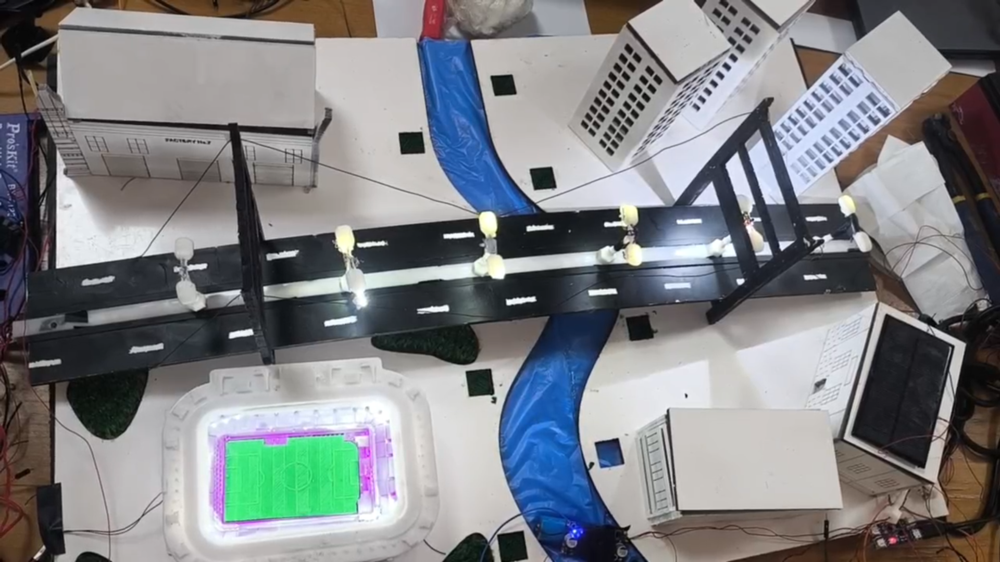
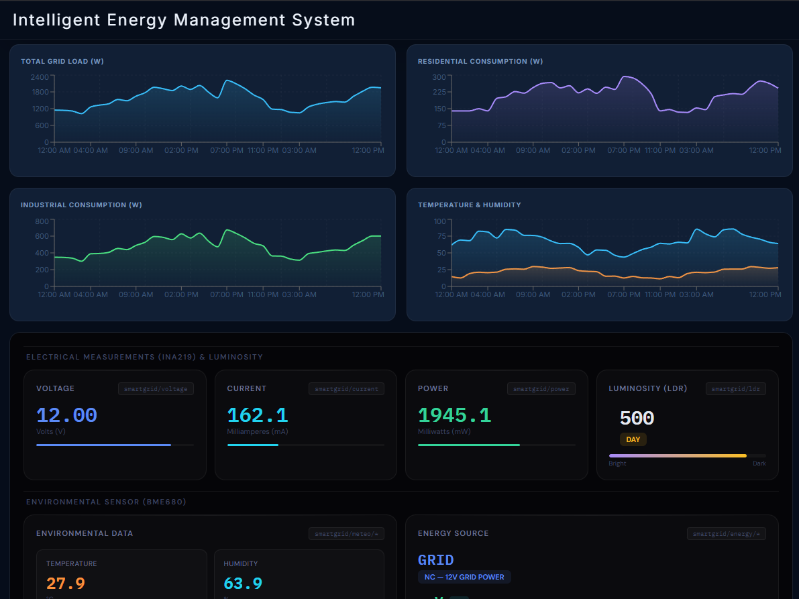

# Smart Grid Management System & Digital Twin

Multidisciplinary project (*Projet Pluridisciplinaire*) at **ESI SBA**



## About the project

We built a small-scale smart grid. An ESP32 controls the lighting of a few city zones and a motor (the industrial zone) using PWM, measures the power consumption, and picks between solar and grid power. A React dashboard shows everything live, with a digital twin of the city drawn in SVG and an admin panel to control the system.

The ESP32 and the dashboard talk to each other over MQTT.

What the system does:
- Measures voltage, current and power with an INA219, and reads temperature, humidity, pressure and gas with a BME680.
- Controls 5 zones with PWM: residential, commercial, stadium, street lighting and industrial (DC motor).
- Switches between solar and grid using a relay, depending on the battery voltage.
- Has 5 control scenarios (manual, automatic day/night, load shedding, stadium event, weather).
- Detects anomalies: overconsumption, short circuit and voltage drift.

## Demo without hardware

You can run the dashboard without an ESP32. In that case it replays a recorded dataset (`src/data/simulation.json`) instead of using live data.

- The dataset covers 72 hours. The demo plays **1 hour of data per second** and loops when it reaches the end.
- It includes three fault events (voltage spike, partial outage, sensor malfunction), which show up on the digital twin.
- The map and the charts are driven by this data, and the same values are sent to the admin panel with `postMessage`.

Things to know about the demo:
- The admin panel is the same one used with the real hardware. Its buttons (scenarios, sliders, etc.) publish MQTT messages, so **they only do something when an ESP32 is connected to the same broker**. In the demo they don't change the playback.

## Architecture

```text
   ESP32 (main.cpp)                              Browser
  +-------------------------+                +---------------------------------+
  | Sensors                 |                | React + Vite app                |
  |  INA219, BME680, LDR,   |   MQTT         |  - SVG digital twin + charts    |
  |  battery voltage divider|  (WebSockets   |  - admin panel (admin-v3.html,  |
  |                         |<------------->|    loaded in an iframe)         |
  | Actuators               |   HiveMQ)      |                                 |
  |  4 LED strips, 1 motor  |                |  Demo mode: simulation.json     |
  |  (PWM), solar/grid relay|                |  feeds the twin and the panel   |
  +-------------------------+                +---------------------------------+
```

## Scenarios

The scenario is chosen from the dashboard (topic `smartgrid/scenario`). The values below are the PWM percentages from `main.cpp` (residential / commercial / stadium / street / industrial).

| Scenario | What it does |
|---|---|
| `MANUEL` | Manual control. Each zone has an on/off switch and a 0-100% slider. Touching any of them switches the system to manual. |
| `AUTO` | Default mode. Reads the LDR and sets the zones for 5 periods of the day (day, dawn, twilight, dusk, night). For example during the day the street lights are at 0%, and at night they are at 100%. |
| `DELESTAGE` | Load shedding with 5 levels, chosen by the admin (see below). The ESP32 also suggests a level from the measured power. |
| `EVENEMENT` | Stadium event. The admin sends a start and end time. See below. |
| `METEO` | Adapts the zones to the BME680 readings. See below. |

**Day/night (AUTO).** The LDR is wired so that the value goes *up* when it gets darker (below 1000 is day, above 2000 is night).

| Period | Res | Com | Stadium | Street | Industrial |
|---|---|---|---|---|---|
| Day | 20 | 80 | 0 | 0 | 100 |
| Dawn | 30 | 70 | 20 | 20 | 90 |
| Twilight | 50 | 60 | 40 | 50 | 85 |
| Dusk | 70 | 55 | 50 | 80 | 80 |
| Night | 80 | 50 | 100 | 100 | 75 |

**Load shedding (DELESTAGE).** The admin picks the level with `smartgrid/delestage/mode`. It only works while the DELESTAGE scenario is active. The ESP32 publishes a suggested level on `smartgrid/delestage/suggestion` (0 to 4) based on the power: 1500, 3000, 4500 and 6000 mW.

| Level | Res | Com | Stadium | Street | Industrial |
|---|---|---|---|---|---|
| `NORMAL` | 100 | 100 | 100 | 100 | 100 |
| `ALERTE` | 100 | 100 | 100 | 50 | 100 |
| `CRITIQUE` | 100 | 50 | 100 | 50 | 80 |
| `URGENCE` | 50 | 50 | 100 | 30 | 70 |
| `BLACKOUT` | off | off | 100 | off | 70 |

**Stadium event (EVENEMENT).** The dashboard sends `HH:MM,HH:MM` (start, end) and the ESP32 uses the time from NTP (UTC+1).
- 30 minutes before the start: lights are raised in the stadium and the streets.
- During the event: stadium and street lights at 100%, residential and commercial at 50%.
- Industrial zone: stays at 100% if the event starts before 16:00, otherwise it is limited to 70% to protect the grid.
- When the event ends, the system goes back to `AUTO`. It can also be cancelled from the dashboard.

**Weather (METEO).** The checks are done in this order and the first one that matches is applied:
- Temperature above 35 °C: motor (ventilation) at 100% and the lighting is reduced.
- Temperature below 5 °C: residential and street lighting at 100%.
- Humidity above 80%: ventilation increased.
- Pressure below 1000 hPa (storm): street lighting at 100%, stadium reduced to 30%.
- Pressure above 1025 hPa (fair weather): street lighting reduced to save energy.
- Otherwise: normal profile.

This scenario only works if the BME680 was detected at startup.

**Anomalies.** These checks run in every scenario (only if the INA219 is detected):
- Overconsumption: power is more than 1.5 times the running average.
- Short circuit: current above 3000 mA. All zones are switched off.
- Voltage drift: voltage outside 11 - 13 V.

**Solar / grid.** The battery voltage is read on GPIO 33 through a voltage divider. In auto mode, the relay goes back to the grid when the battery drops below 3.0 V and returns to solar above 3.2 V (two thresholds, so the relay doesn't keep switching). The source can also be forced manually from the dashboard.

## Tech stack

- **Dashboard:** React, Vite, Material-UI, Recharts, plain CSS
- **Digital twin:** SVG drawn in React
- **Communication:** MQTT over WebSockets (HiveMQ), mqtt.js in the browser
- **Firmware:** ESP32, C++ with the Arduino framework
- **Electronics:** INA219, BME680, LDR, HW-291 relay module, IRLZ44N MOSFETs, 12V DC motor, 12V LED strips

## Running the demo

You need Node.js (a recent LTS version).

```bash
git clone https://github.com/Amine-Sai/smartgrid-digital-twin.git
cd smartgrid-digital-twin
npm install
npm run dev
```

Then open `http://localhost:5173/`. The simulation starts by itself.



## Hardware setup

### Pinout

| Zone / component | Hardware | Pin | Notes |
|---|---|---|---|
| Residential | IRLZ44N + LED strip | GPIO 16 | |
| Commercial | IRLZ44N + LED strip | GPIO 27 | |
| Stadium | IRLZ44N + LED strip | GPIO 25 | floodlights |
| Street lighting | IRLZ44N + LED strip | GPIO 26 | |
| Industrial | IRLZ44N + DC motor | GPIO 23 | PWM is never below 70%, otherwise the motor stalls |
| INA219 | I2C, address 0x45 | SDA 21 / SCL 22 | voltage, current, power |
| BME680 | I2C, address 0x77 | SDA 21 / SCL 22 | temperature, humidity, pressure, gas |
| LDR | analog | GPIO 32 | 0 - 4095 |
| Solar / grid relay | HW-291 | GPIO 17 | HIGH = solar, LOW = grid |
| Battery voltage | voltage divider (÷2) | GPIO 33 | analog |


### Flashing the ESP32

1. Create a PlatformIO project for an ESP32 board and put `main.cpp` in the `src/` folder.
2. Add the libraries and the platform in `platformio.ini`:
   ```ini
   [env:esp32dev]
   platform = espressif32@^6
   board = esp32dev
   framework = arduino
   monitor_speed = 115200
   lib_deps =
       knolleary/PubSubClient
       adafruit/Adafruit INA219
       adafruit/Adafruit BME680 Library
   ```
3. Fill in your WiFi name and password and the MQTT settings at the top of `main.cpp`.
4. Build, upload, and open the serial monitor at 115200 baud.

**The ESP32 and the dashboard must use the same broker.** The admin panel connects to `wss://broker.hivemq.com:8884/mqtt` (the `BROKER` constant in `public/admin-v3.html`), which is a public broker with no login. If you use your own HiveMQ Cloud cluster in `main.cpp`, change `BROKER` in the admin panel to your cluster as well. Since a public broker is open to everyone, anyone using the same `smartgrid/` topics would see (and control) your system.

## MQTT topics

All topics start with `smartgrid/`. The names are in French because that is what my teammate used from the start (`moteur`, `evenement`, `humidite`...).

**Commands (dashboard to ESP32)**

| Topic | Payload |
|---|---|
| `scenario` | `MANUEL`, `AUTO`, `DELESTAGE`, `EVENEMENT` or `METEO` |
| `delestage/mode` | `NORMAL`, `ALERTE`, `CRITIQUE`, `URGENCE` or `BLACKOUT` |
| `led1` ... `led4` | `ON` / `OFF` (residential, commercial, stadium, street) |
| `led1/brightness` ... `led4/brightness` | 0 - 100 |
| `moteur` | `ON`, `OFF` or 0 - 100 |
| `moteur/brightness` | 0 - 100 |
| `evenement/config` | `HH:MM,HH:MM` (start, end) |
| `evenement/annuler` | anything |
| `energy/mode` | `AUTO` or `MANUEL` (how the solar/grid source is chosen) |
| `energy/select` | `SOLAR` or `GRID` (only in manual mode) |

**Telemetry (ESP32 to dashboard)**

| Topic | Payload |
|---|---|
| `voltage` | bus voltage in V |
| `current` | current in mA |
| `power` | power in mW |
| `ldr` | raw light value (0 - 4095) |
| `meteo/temperature`, `meteo/humidite`, `meteo/pression`, `meteo/gaz` | °C, %, hPa, kOhm |
| `meteo/alerte` | `CHALEUR`, `FROID`, `HUMIDITE`, `TEMPETE`, `BEAU_TEMPS` or `NORMAL` |
| `scenario/actuel` | active scenario |
| `delestage/niveau`, `delestage/suggestion`, `delestage/erreur` | current level, suggested level (0 - 4), error if load shedding is not active |
| `periode` | `jour`, `crepuscule_matin`, `crepuscule`, `crepuscule_soir` or `nuit` |
| `evenement/phase` | `AVANT`, `PENDANT`, `FIN` or `ANNULE` |
| `led1/duty` ... `led4/duty`, `moteur/duty` | current PWM in % |
| `led1/state` ... `led4/state`, `moteur/state` | `ON` / `OFF` |
| `energy/source`, `energy/mode_status` | `SOLAR` / `GRID`, `AUTO` / `MANUEL` |
| `energy/battery_voltage`, `energy/battery_status` | V, `PLEINE` / `MOYENNE` / `FAIBLE` / `VIDE` |
| `anomalie/type`, `anomalie/valeur` | `SURCONSOMMATION`, `COURT_CIRCUIT` or `DERIVE_TENSION`, and the value |
| `status` | `ONLINE` when the ESP32 connects |

## Project structure

```text
.
├── main.cpp                  # ESP32 firmware
├── package.json
├── vite.config.js
├── eslint.config.js
├── index.html
├── README.md
├── docs/images/              # screenshots used in this README
├── public/
│   └── admin-v3.html         # admin panel (MQTT console, controls), shown in an iframe
└── src/
    ├── main.jsx
    ├── App.jsx               # theme + layout
    ├── App.css
    ├── index.css
    ├── components/Layout/
    │   └── Layout.jsx        # top bar
    ├── data/
    │   └── simulation.json   # recorded dataset for the demo
    └── pages/
        ├── Dashboard.jsx
        └── DigitalTwin.jsx
```

## Limitations

- The demo replays recorded data. It doesn't react to the scenario buttons.
- The anomaly detection is simple (thresholds and a running average), not a real fault detection model.

## Authors

Saidane Mohamed Elamine
Bensaleh Merwane